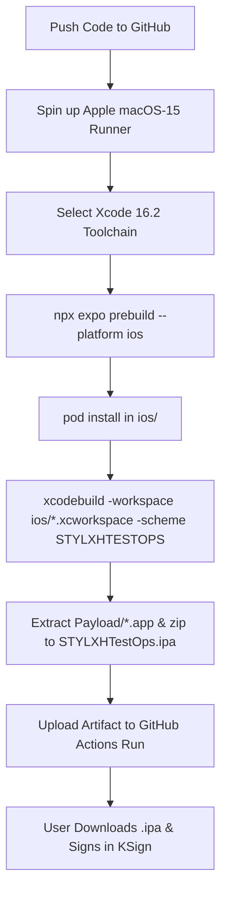

# STYLXH TEST OPS — Architecture, Build Pipeline & KSign Sideloading Blueprint

> **Purpose:** This document provides a complete technical explanation of the application architecture, the native compilation pipeline, and the KSign sideloading process so an external developer or consultant can immediately understand how the app is structured, built, signed, and where potential issues arise.

---

## 1. High-Level Overview

* **App Name:** `STYLXH TEST OPS` (formerly `IT Hero Ops`)
* **Bundle Identifier:** `com.stylxh.testops`
* **Target Platform:** iOS (iPhone & iPad, portrait orientation)
* **Distribution Method:** Sideloading via **KSign** (or AltStore / Sideloadly) using personal or enterprise certificates without App Store / TestFlight.
* **Core Technology Stack:**
  * **Framework:** React Native (`v0.86.3`) with Expo SDK (`v57.0.23`)
  * **Engine:** Hermes Bytecode Engine
  * **Native Bridge:** New Architecture enabled / CocoaPods native modules (`expo-file-system`, `expo-sharing`, `expo-mail-composer`, `expo-status-bar`, `@expo/vector-icons`)
  * **Payroll Calculation / Export:** `xlsx` engine with custom base64-encoded Excel templates.

---

## 2. Directory Structure

```text
d:\AA STYLXH STUDIOS\apps\it hero app\new\
├── .github/
│   └── workflows/
│       └── build-ipa.yml        # Cloud macOS GitHub Actions pipeline compiling with Xcode
├── src/
│   ├── assets/
│   │   ├── template.xlsx        # Master Excel timesheet template
│   │   └── templateBase64.js    # Base64 string for offline injection
│   ├── components/
│   │   ├── WarehouseSwapScreen.js  # Gate PIN, warehouse start/end of day checks
│   │   ├── HeroOpsScreen.js        # 5-step technician wizard & troubleshooting
│   │   ├── TimesheetScreen.js      # Weekly payroll timesheet with 12h time picker
│   │   └── PhotoReferenceScreen.js # Offline field guides & hardware standards
│   ├── config/
│   │   └── defaultProfile.js    # Technician profile defaults & work presets
│   ├── services/
│   │   ├── timesheetService.js  # Hours calculation, break deduction, cell mapping
│   │   ├── serviceM8Parser.js   # Clipboard parser for ServiceM8 job sheets
│   │   └── exportService.js     # Native Share sheet and mail composer
│   └── styles/
│       └── theme.js             # Styling tokens and dark color palette
├── App.js                       # Root container, bottom tab navigation, state sync
├── app.json                     # Expo & iOS bundle metadata, permissions, display name
├── package.json                 # Dependencies and build scripts
└── package_ipa.py               # Local packaging script for packaging offline bundles
```

---

## 3. How the App Works (Component Breakdown)

1. **Warehouse Tab (`WarehouseSwapScreen.js`)**:
   - Manages warehouse check-in with gate code `#59582560`.
   - Unlocks Start of Day tool verification before dispatch.
   - Handles Return to HQ checklists (personal keys, company keys in lock, tools returned).
2. **Hero Ops Tab (`HeroOpsScreen.js`)**:
   - 5-step field wizard:
     1. Store / Client selection (Woolworths, IGA, Coles, Dan Murphy's).
     2. Job Type (Media Player Swap, Router Swap, PCU Swap, Proactive Clean).
     3. Screen / Mount Location (Standard bracket, High suspended with ladder protocol, Cartology kiosk).
     4. Department (Seafood, Deli, Bakery, Produce, BOH Rack, etc.).
     5. 13-point interactive checklist & step-by-step diagnostic workflow.
   - Includes real-time ServiceM8 job parser to paste job dispatches and auto-populate all fields.
3. **Timesheet Tab (`TimesheetScreen.js`)**:
   - Full 7-day payroll tracker (Thursday to Wednesday cycle).
   - Auto-calculates gross hours, breaks, net billable hours, non-billable time, and meal allowances.
   - Direct `.xlsx` export using `xlsx` library and native iOS share sheet (`exportService.js`).
4. **How-To Tab (`PhotoReferenceScreen.js`)**:
   - Offline knowledge base containing field rules, ladder safety protocols, Broadsign kiosk escape methods, and retail comms rack guides.

---

## 4. The Build & Sideloading Pipeline

### Why an `.ipa` is Required:
* **The Goal:** Run the app standalone on an iPhone without a development server, computer cable, or Expo Go (which goes offline or crashes when backgrounded).
* **The Challenge:** The developer's primary machine runs **Windows 10**. Apple's native compiler (`clang`, `ld64`, `xcodebuild`) only runs on **macOS**.
* **Why Dummy / Web Packaging Failed:**
  - An `.ipa` file is an archive with a `Payload/<AppName>.app/` folder.
  - When installed via KSign, iOS verifies whether the executable inside is a valid **Apple Mach-O 64-bit ARM64 executable binary**.
  - If it is missing or not compiled by Xcode, iOS immediately halts installation with the pop-up: **"Unable to Install. Please try again later"**.

---

## 5. The Cloud Compilation Pipeline (GitHub Actions)

To avoid paid services while producing official Xcode-compiled binaries, we utilize a free **GitHub Actions** workflow (`.github/workflows/build-ipa.yml`) running on Apple's cloud hardware:



### Key Workflow Configuration (`.github/workflows/build-ipa.yml`):
* **Runner Environment:** `macos-15` (Apple Silicon M2/M3 infrastructure)
* **Xcode Version:** Selected via `sudo xcode-select -s /Applications/Xcode_16.2.app/Contents/Developer` (Required because React Native 0.76+ mandates Xcode $\ge$ 16.1).
* **Prebuild Command:** `npx expo prebuild --platform ios --clean --no-install` (Generates native Objective-C/Swift project and `Podfile`).
* **Pod Installation:** `pod install` executed inside `ios/`.
* **Compilation Command:**
  ```bash
  WORKSPACE=$(find ios -maxdepth 1 -name "*.xcworkspace" | head -n 1)
  xcodebuild -workspace "$WORKSPACE" \
             -scheme "STYLXHTESTOPS" \
             -configuration Release \
             -sdk iphoneos \
             -destination "generic/platform=iOS" \
             -derivedDataPath build \
             CODE_SIGN_IDENTITY="" \
             CODE_SIGNING_REQUIRED=NO \
             CODE_SIGNING_ALLOWED=NO
  ```
* **Packaging:**
  ```bash
  mkdir -p Payload
  cp -r build/Build/Products/Release-iphoneos/*.app Payload/
  zip -r -y STYLXHTestOps.ipa Payload
  ```

---

## 6. Sideloading via KSign

1. **Input File:** Unsigned `STYLXHTestOps.ipa` generated by the pipeline above.
2. **KSign Operation:**
   - KSign unpacks the `.ipa`.
   - Injects the user's certificate (`.p12` + mobileprovision profile).
   - Re-signs all native dynamic frameworks (`Frameworks/*.dylib`, `ExpoModulesCore`, etc.) and the main executable.
   - Packs it back into an installable format and calls the iOS private `MobileInstallation` service.
3. **Execution:** iOS launches the signed native binary, Hermes initializes, and the app runs 100% offline with full hardware access.

---

## 7. Current Troubleshooting Checklist (For External Review)

If you are reviewing or debugging this build pipeline, check the following points:

1. **Workspace vs. Project Resolution:**
   - Ensure `xcodebuild` targets `ios/STYLXHTESTOPS.xcworkspace` and NOT `ios/STYLXHTESTOPS.xcodeproj/project.xcworkspace`. Targeting the `.xcodeproj` causes missing header/framework errors for CocoaPods dependencies.
2. **Scheme Naming:**
   - Expo generates the Xcode scheme based on the app name (`STYLXHTESTOPS`). Verify `xcodebuild -list -workspace ios/*.xcworkspace` confirms the active scheme name.
3. **Target Architecture:**
   - Must use `-destination "generic/platform=iOS"` and `-sdk iphoneos` so that the output product in `build/Build/Products/Release-iphoneos/` is built for ARM64 devices and not the iOS Simulator.
4. **Code Signing Flags:**
   - Because KSign does the actual signing on the device, the CI build MUST set:
     `CODE_SIGN_IDENTITY="" CODE_SIGNING_REQUIRED=NO CODE_SIGNING_ALLOWED=NO`
   - Otherwise, Xcode will fail in CI requesting Apple Developer certificates and provisioning profiles.
